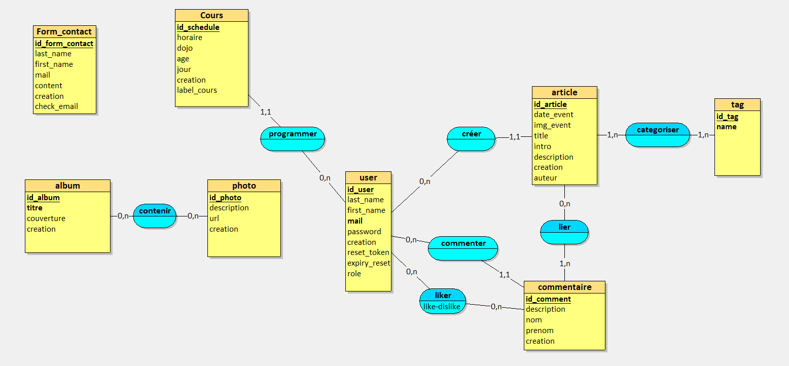
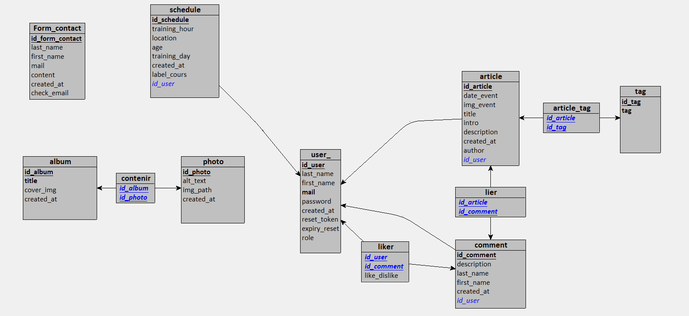
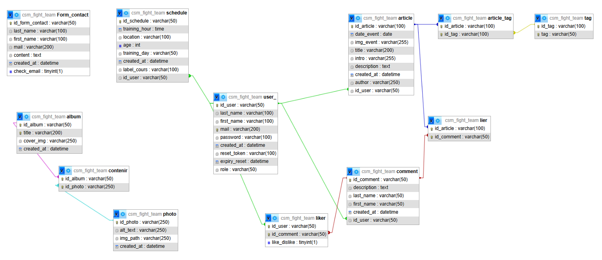

# Projet CSM Fight Team

Ce projet est le dossier permettant de travailler sur la refonte du site internet d'un club sportif.

## Pré requis

 L'installation de nodejs et github sont necéssaire pour travailler sur ce projet.

 ## Objectifs

 Créer un site qui permettra une bonne expérience à l'utilisateur et faciliter sa navigation sur ce nouveau site

=======
# CSM Fight Team - Site du club

Création: 15 Décembre 2025
Ce projet découle de l'envie d'améliorer le site internet d'un club sportif.


## Description

Site d'informations du club avec accès aux informations suivantes:
- les coordonnées du club, 
- les informations sur les cours,
- page infos de la vie du club
- un catalogue d'articles, 
- une galerie photo, 
- un lien vers des sites externes (notamment le site de la fédération de judo),
- une page contact.

## Compétences visées

### Réaliser des interfaces utilisateur statiques web ou web mobile

- **Compétences** : Développement de pages web en utilisant HTML5 et CSS3, compréhension de la mise en page responsive.
- **Exemple** : Codage en HTML5 et CSS3 pour structurer des pages web et appliquer des styles.

### Développer la partie dynamique des interfaces utilisateur web ou web mobile

- **Compétences** : Programmation en JavaScript, utilisation de bibliothèques et frameworks pour enrichir l'interaction utilisateur.
- **Exemple** : Utilisation de JavaScript pour rendre les interfaces interactives.

## Fonctionnalités

- Affichage d'un catalogue d'articles grace a la methode fetch
- Recherche d'article par mots clés
- Page de détails d'un article
- Design moderne et accessible
- Page de contact avec envoi de mail via EmailJS

## Technologies utilisées

- HTML5 (balises sémantiques)
- CSS3 (Flexbox, Grid, Media Queries)
- JavaScript ES6 (Fetch API, Modules)
- EmailJS
- Vercel: https://csm-fight-team.vercel.app/


## Installation

1. Cloner le repository
```bash
git clone https://github.com/Melichoux/CSM-Fight-Team.git
```

## BDD

1. Merise


[Cliquer pour acceder au dictionnaire de données](<assets/images/merise/Dictionnaire de données.pdf>)

Schema MCD (looping):

Schema MLD (looping):

Schema MPD(php my admin):


2. Creation de la base de données

Voici le code pour recréer la base de données:

```sql
CREATE DATABASE IF NOT EXIST csm_fight_team;
USE csm_fight_team;
CREATE TABLE Form_contact(
   id_form_contact VARCHAR(50),
   last_name VARCHAR(100) NOT NULL,
   first_name VARCHAR(100) NOT NULL,
   mail VARCHAR(200) NOT NULL,
   content TEXT NOT NULL,
   created_at DATETIME NOT NULL,
   check_email LOGICAL,
   PRIMARY KEY(id_form_contact)
);

CREATE TABLE user_(
   id_user VARCHAR(50),
   last_name VARCHAR(100) NOT NULL,
   first_name VARCHAR(100) NOT NULL,
   mail VARCHAR(200) NOT NULL,
   password VARCHAR(100) NOT NULL,
   created_at DATETIME NOT NULL,
   reset_token VARCHAR(100),
   expiry_reset DATETIME,
   role VARCHAR(50),
   PRIMARY KEY(id_user),
   UNIQUE(mail)
);

CREATE TABLE article(
   id_article VARCHAR(100),
   date_event DATE,
   img_event VARCHAR(255),
   title VARCHAR(200),
   intro VARCHAR(255),
   description TEXT,
   created_at DATETIME NOT NULL,
   author VARCHAR(250) NOT NULL,
   id_user VARCHAR(50) NOT NULL,
   PRIMARY KEY(id_article),
   FOREIGN KEY(id_user) REFERENCES user_(id_user)
);

CREATE TABLE tag(
   id_tag VARCHAR(100),
   tag VARCHAR(50) NOT NULL,
   PRIMARY KEY(id_tag),
   UNIQUE(tag)
);

CREATE TABLE schedule(
   id_schedule VARCHAR(50),
   training_hour TIME NOT NULL,
   location VARCHAR(100) NOT NULL,
   age INT NOT NULL,
   training_day VARCHAR(50) NOT NULL,
   created_at DATETIME NOT NULL,
   label_cours VARCHAR(100),
   id_user VARCHAR(50) NOT NULL,
   PRIMARY KEY(id_schedule),
   FOREIGN KEY(id_user) REFERENCES user_(id_user)
);

CREATE TABLE comment(
   id_comment VARCHAR(50),
   description TEXT NOT NULL,
   last_name VARCHAR(50) NOT NULL,
   first_name VARCHAR(50) NOT NULL,
   created_at DATETIME NOT NULL,
   id_user VARCHAR(50) NOT NULL,
   PRIMARY KEY(id_comment),
   FOREIGN KEY(id_user) REFERENCES user_(id_user)
);

CREATE TABLE album(
   id_album VARCHAR(50),
   title VARCHAR(200) NOT NULL,
   cover_img VARCHAR(250),
   created_at DATETIME NOT NULL,
   PRIMARY KEY(id_album),
   UNIQUE(title)
);

CREATE TABLE photo(
   id_photo VARCHAR(250),
   alt_text VARCHAR(250) NOT NULL,
   img_path VARCHAR(250) NOT NULL,
   created_at DATETIME NOT NULL,
   PRIMARY KEY(id_photo)
);

CREATE TABLE article_tag(
   id_article VARCHAR(100),
   id_tag VARCHAR(100),
   PRIMARY KEY(id_article, id_tag),
   FOREIGN KEY(id_article) REFERENCES article(id_article),
   FOREIGN KEY(id_tag) REFERENCES tag(id_tag)
);

CREATE TABLE lier(
   id_article VARCHAR(100),
   id_comment VARCHAR(50),
   PRIMARY KEY(id_article, id_comment),
   FOREIGN KEY(id_article) REFERENCES article(id_article),
   FOREIGN KEY(id_comment) REFERENCES comment(id_comment)
);

CREATE TABLE liker(
   id_user VARCHAR(50),
   id_comment VARCHAR(50),
   like_dislike LOGICAL,
   PRIMARY KEY(id_user, id_comment),
   FOREIGN KEY(id_user) REFERENCES user_(id_user),
   FOREIGN KEY(id_comment) REFERENCES comment(id_comment)
);

CREATE TABLE contenir(
   id_album VARCHAR(50),
   id_photo VARCHAR(250),
   PRIMARY KEY(id_album, id_photo),
   FOREIGN KEY(id_album) REFERENCES album(id_album),
   FOREIGN KEY(id_photo) REFERENCES photo(id_photo)
);

```

3. SQL ATTENTION préciser les relations entre les tables, identifier les FK pour le delete on cascade et ne pas faire d'erreur (preciser les fk delete on cascade)
