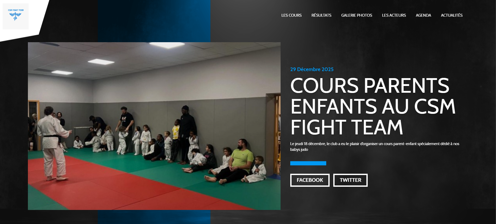

# Projet CSM Fight Team

Ce projet porte sur la refonte du site internet d'un club sportif.

## Pré requis

 L'installation d'un environnement LAMP ainsi que de nodejs, github, docker, phpmyadmin, vscode et gitbash sont necéssaire pour travailler sur ce projet.

 ## Objectifs

 Créer un site qui permettra une bonne expérience à l'utilisateur et faciliter sa navigation sur ce nouveau site


# CSM Fight Team - Site du club

Création: 15 Décembre 2025
Ce projet découle de l'envie d'améliorer le site internet d'un club sportif.


## Description

Site d'informations du club avec accès aux informations suivantes:
- les coordonnées du club, 
- les informations sur les cours,
- page infos de la vie du club
- un catalogue d'articles, 
- une galerie photo, 
- un lien vers des sites externes (notamment le site de la fédération de judo),
- une page contact
- un espace d'inscription,
- un espace connexion,
- compte admin pour modifier le conteu du site

## Compétences visées frontend (Partie 1)

### Réaliser des interfaces utilisateur statiques web ou web mobile

- **Compétences** : Développement de pages web en utilisant HTML5 et CSS3, compréhension de la mise en page responsive.
- **Exemple** : Codage en HTML5 et CSS3 pour structurer des pages web et appliquer des styles.

### Développer la partie dynamique des interfaces utilisateur web ou web mobile

- **Compétences** : Programmation en JavaScript, utilisation de bibliothèques et frameworks pour enrichir l'interaction utilisateur.
- **Exemple** : Utilisation de JavaScript pour rendre les interfaces interactives.

### Fonctionnalités

- Affichage d'un catalogue d'articles grace a la methode fetch
- Recherche d'article par mots clés
- Page de détails d'un article
- Design moderne et accessible
- Page de contact avec envoi de mail via EmailJS

### Technologies utilisées

- HTML5 (balises sémantiques)
- CSS3 (Flexbox, Grid, Media Queries)
- JavaScript ES6 (Fetch API, Modules)
- EmailJS
- Vercel: https://csm-fight-team.vercel.app/

## Compétences visées backend (Partie)

### Compétences
 - Mettre en place une base de données relationnelle,
 - Développer des composants d'accès aux données SQL et NoSQL,
 - Développer des composants métier côté serveur,
 - Documenter le déploiement d'une application dynamique web ou web mobile.

### Fonctionnalités

- Affichage d'un catalogue d'articles grace a la methode fetch
- Recherche d'article par mots clés
- Page de détails d'un article

### Technologies utilisées
 - LAMP
 - Mysql
 - PHP 8.4.18
 - Phpmyadmin 5.2.2
 - Docker
 - Extension GD Library
 - Entension Email.js puis PHPMailer (remplace Email.js apres integration du back au projet)

## Installation

1. Cloner le repository
```bash
git clone https://github.com/Melichoux/CSM-Fight-Team.git
```
----------------------------------------------------------
## Activation de l'extension GD (PHP)

Requis pour le traitement et l'upload des images (crop, resize, conversion WEBP).

### 1. Ajouter les librairies système dans `Dockerfile.php`

Dans le bloc `apt-get install`, ajouter :

```dockerfile
libpng-dev libjpeg-dev libwebp-dev \
```

### 2. Configurer et installer l'extension GD dans `Dockerfile.php`

Remplacer le bloc `docker-php-ext-install` par :

```dockerfile
RUN docker-php-ext-configure gd --with-jpeg --with-webp \
  && docker-php-ext-install \
    pdo pdo_mysql pdo_pgsql mysqli zip \
    intl mbstring opcache gd
```

### 3. Rebuilder le conteneur Docker

Dans le terminal, à la racine du projet :

```bash
docker compose down
docker compose up --build
```

> Les données MySQL sont persistées via un volume Docker et ne sont pas affectées par le rebuild.
---------------------------------------------------
## BDD

1. Merise
----------

[Cliquer pour acceder au dictionnaire de données](<assets/images/merise/Dictionnaire de données.pdf>)

Schema MCD (looping):

Schema MLD (looping):

Schema MPD(php my admin):


2. Creation de la base de données
-----------
Voici le code pour recréer la base de données:

```sql
DROP DATABASE IF EXISTS csm_fight_team;
CREATE DATABASE csm_fight_team;
USE csm_fight_team;

CREATE TABLE csm_Form_contact(
   id_form INT UNSIGNED AUTO_INCREMENT,
   last_name VARCHAR(100) NOT NULL,
   first_name VARCHAR(100) NOT NULL,
   email VARCHAR(254) NOT NULL,
   content TEXT NOT NULL,
   created_at DATETIME DEFAULT CURRENT_TIMESTAMP NOT NULL,
   check_email BOOLEAN DEFAULT false,
   PRIMARY KEY(id_form)
);

CREATE TABLE csm_user(
   id_user INT UNSIGNED AUTO_INCREMENT,
   last_name VARCHAR(100) NOT NULL,
   first_name VARCHAR(100) NOT NULL,
   email VARCHAR(254) NOT NULL,
   password VARCHAR(255) NOT NULL,
   created_at DATETIME DEFAULT CURRENT_TIMESTAMP NOT NULL,
   reset_token VARCHAR(100),
   expiry_reset DATETIME,
   role ENUM('admin','user') DEFAULT 'user',
   PRIMARY KEY(id_user),
   UNIQUE(email)
);

CREATE TABLE csm_article(
   id_article INT UNSIGNED AUTO_INCREMENT,
   date_event DATE,
   img_event VARCHAR(255),
   title VARCHAR(200),
   intro VARCHAR(255),
   description TEXT,
   created_at DATETIME DEFAULT CURRENT_TIMESTAMP NOT NULL,
   id_user INT UNSIGNED NOT NULL DEFAULT 1,
   PRIMARY KEY(id_article),
   FOREIGN KEY(id_user) REFERENCES csm_user(id_user)
      ON DELETE CASCADE
      ON UPDATE CASCADE
);

CREATE TABLE csm_tag(
   id_tag INT UNSIGNED AUTO_INCREMENT,
   tag VARCHAR(50) NOT NULL,
   PRIMARY KEY(id_tag),
   UNIQUE(tag)
);

CREATE TABLE csm_time_slot(
   id_time_slot INT UNSIGNED AUTO_INCREMENT,
   start_time TIME NOT NULL,
   end_time TIME NOT NULL,
   label_cours VARCHAR(100),
   age_min TINYINT UNSIGNED NOT NULL CHECK (age_min >= 3),
   age_max TINYINT UNSIGNED NULL,
   created_at DATETIME DEFAULT CURRENT_TIMESTAMP NOT NULL,
   id_user INT UNSIGNED NOT NULL,
   PRIMARY KEY(id_time_slot),
   FOREIGN KEY(id_user) REFERENCES csm_user(id_user)
      ON DELETE CASCADE
      ON UPDATE CASCADE
);

CREATE TABLE csm_slot_day(
   id_slot_day INT UNSIGNED NOT NULL AUTO_INCREMENT,
   training_day ENUM('Lundi','Mardi','Mercredi','Jeudi','Vendredi','Samedi','Dimanche') NOT NULL,
   PRIMARY KEY(id_slot_day),
   UNIQUE(training_day)
);

CREATE TABLE csm_comment(
   id_comment INT UNSIGNED NOT NULL AUTO_INCREMENT,
   description TEXT NOT NULL,
   last_name VARCHAR(50) NOT NULL,
   first_name VARCHAR(50) NOT NULL,
   created_at DATETIME DEFAULT CURRENT_TIMESTAMP NOT NULL,
   id_user INT UNSIGNED NOT NULL,
   PRIMARY KEY(id_comment),
   FOREIGN KEY(id_user) REFERENCES csm_user(id_user)
      ON DELETE CASCADE
      ON UPDATE CASCADE
);

CREATE TABLE csm_album(
   id_album INT UNSIGNED AUTO_INCREMENT,
   title VARCHAR(200) NOT NULL,
   cover_img VARCHAR(250),
   created_at DATETIME DEFAULT CURRENT_TIMESTAMP NOT NULL,
   PRIMARY KEY(id_album),
   UNIQUE(title)
);

CREATE TABLE csm_photo(
   id_photo INT UNSIGNED AUTO_INCREMENT,
   alt_text VARCHAR(250) NOT NULL,
   img_path VARCHAR(250) NOT NULL,
   created_at DATETIME DEFAULT CURRENT_TIMESTAMP NOT NULL,
   PRIMARY KEY(id_photo)
);

-- Tables associatives

CREATE TABLE csm_article_tag(
   id_article INT UNSIGNED NOT NULL,
   id_tag INT UNSIGNED NOT NULL,
   PRIMARY KEY(id_article, id_tag),
   FOREIGN KEY(id_article) REFERENCES csm_article(id_article)
      ON DELETE CASCADE
      ON UPDATE CASCADE,
   FOREIGN KEY(id_tag) REFERENCES csm_tag(id_tag)
      ON DELETE CASCADE
      ON UPDATE CASCADE
);

CREATE TABLE csm_article_comment(
   id_article INT UNSIGNED NOT NULL,
   id_comment INT UNSIGNED NOT NULL,
   PRIMARY KEY(id_article, id_comment),
   FOREIGN KEY(id_article) REFERENCES csm_article(id_article)
      ON DELETE CASCADE
      ON UPDATE CASCADE,
   FOREIGN KEY(id_comment) REFERENCES csm_comment(id_comment)
      ON DELETE CASCADE
      ON UPDATE CASCADE
);

CREATE TABLE csm_user_comment(
   id_user INT UNSIGNED NOT NULL,
   id_comment INT UNSIGNED NOT NULL,
   like_dislike BOOLEAN,
   PRIMARY KEY(id_user, id_comment),
   FOREIGN KEY(id_user) REFERENCES csm_user(id_user)
      ON DELETE CASCADE
      ON UPDATE CASCADE,
   FOREIGN KEY(id_comment) REFERENCES csm_comment(id_comment)
      ON DELETE CASCADE
      ON UPDATE CASCADE
);

CREATE TABLE csm_photo_album(
   id_album INT UNSIGNED NOT NULL,
   id_photo INT UNSIGNED NOT NULL,
   PRIMARY KEY(id_album, id_photo),
   FOREIGN KEY(id_album) REFERENCES csm_album(id_album)
      ON DELETE CASCADE
      ON UPDATE CASCADE,
   FOREIGN KEY(id_photo) REFERENCES csm_photo(id_photo)
      ON DELETE CASCADE
      ON UPDATE CASCADE
);

CREATE TABLE csm_time_slot_day(
   id_time_slot INT UNSIGNED NOT NULL,
   id_slot_day INT UNSIGNED NOT NULL,
   PRIMARY KEY(id_time_slot, id_slot_day),
   FOREIGN KEY(id_time_slot) REFERENCES csm_time_slot(id_time_slot)
      ON DELETE CASCADE
      ON UPDATE CASCADE,
   FOREIGN KEY(id_slot_day) REFERENCES csm_slot_day(id_slot_day)
      ON DELETE CASCADE
      ON UPDATE CASCADE
);
```
Récapitulatif des tables:

- csm_Form_contact
- csm_user_
- csm_article
- csm_tag
- csm_time_slot
- csm_slot_day
- csm_comment
- csm_album
- csm_photo

--- tables associatives ---

- csm_article_tag
- csm_article_comment
- csm_user_comment
- csm_photo_album
- csm_time_slot_day
----------------------
